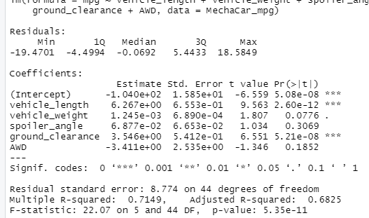
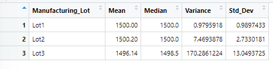
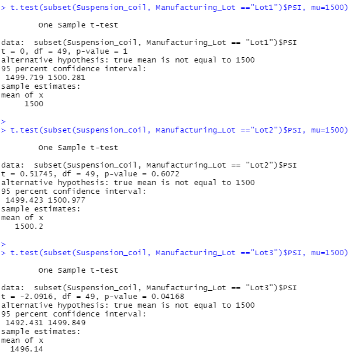

# AutosRus_Assignment
A few weeks after starting his new role, Jeremy is approached by upper management about a special project. AutosRUs’ newest prototype, the MechaCar, is suffering from production troubles that are blocking the manufacturing team’s progress. AutosRUs’ upper management has called on Jeremy and the data analytics team to review the production data for insights that may help the manufacturing team.

In this challenge, you’ll help Jeremy and the data analytics team do the following:

## Deliverable1:  Perform multiple linear regression analysis to identify which variables in the dataset predict the mpg of MechaCar prototypes

* Using the dataset, vehicle_length and ground_clearance have a significant impact on the miles per gallon.

* The intercept is statistically significant and not zero. 

* Multiple R-sqaured value is 0.71 indicating the model does an adequate job of predicting mpg.

## Deliverable2:

* In total the specifications are met with variance of 62.29 (less than 100)

* By lots, lots 1 & 2 are within specifications, however lot 3 has a variance that exceeds specification (100 PSI)

## Deliverable3:
Run t-tests to determine if the manufacturing lots are statistically different from the mean population
* Lot 1 and 2 have the p value higher than 0.05 therefore we reject the null hypothesis, however lot 3, the p-value is less than 0.05 so we reject the alternate hypothesis and the mean value is  significantly different from population mean (1500).

## Deliverable4:
Design a statistical study to compare vehicle performance of the MechaCar vehicles against vehicles from other manufacturers. For each statistical analysis, you’ll write a summary interpretation of the findings.

* An additional metric is horsepower, a smaller engine size results in a higher mile per gallon.

* The null hypothesis would be there is no statistical difference while the alternate hypothesis is a difference.
